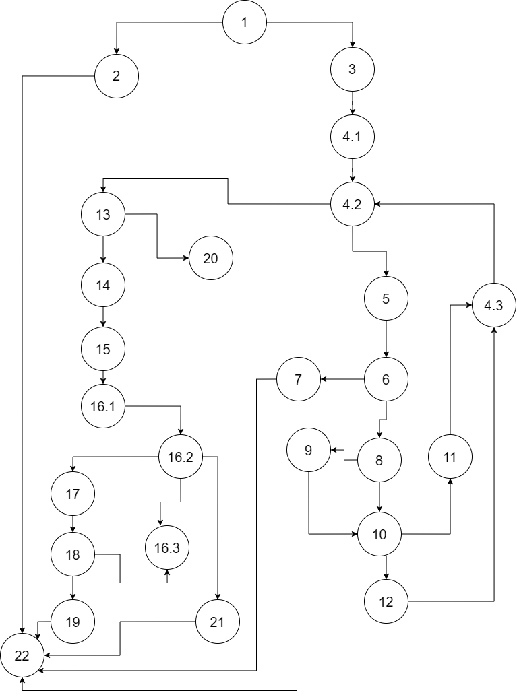
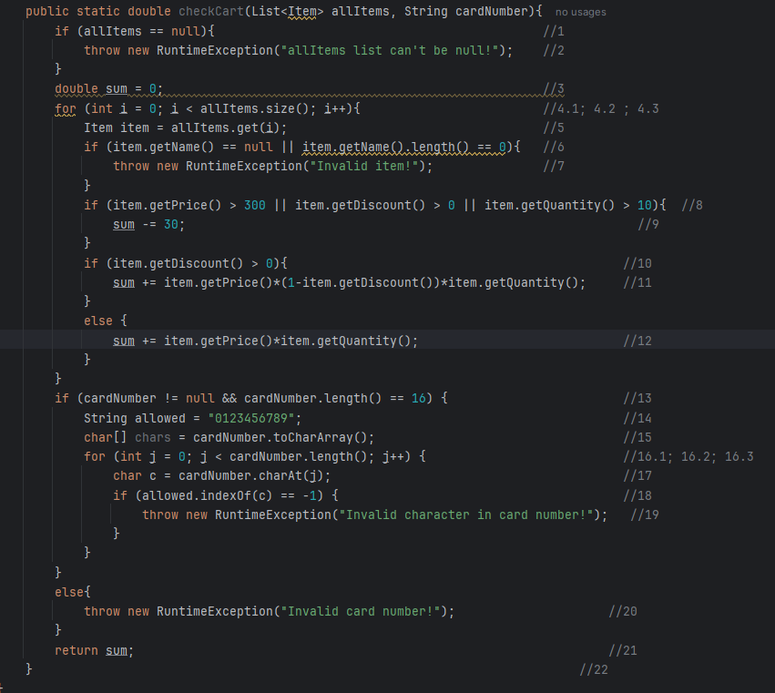

# SI_2025_lab2_236007

## Ефимија Цунева 236007

## Control Flow Graph

## Цикломатска комплексност
Цикломатската комплексност е 9, решението е добиено со броење на регионите во графот.

## Unit тестови

Минималниот број на тестови е 5.
Тест 1:
allItems: null, cardNumber: "1234567891234567"

Тест 2:
List<Item> items1 = List.of(new Item(null, 1 , 100, 0));
allItems: items1, cardNumber: ""

Test 3:
List<Item> items2 = List.of(new Item("Phone", 1 , 1, 0));
allItems: items2, cardNumber: "e123456789876543"

Test 4:
allItems: items2, cardNumber: "123123"

Тест 5:
allItems: items2, cardNumber: "8827389476352617"

Минималниот број на тестови е 4.

TXX:
List<Item> all = List.of(new Item("Item1", 1, 400, 0));
allItems: all, cardNumber: "8827389476352617"

FTX:
List<Item> all2 = List.of(new Item("Item2", 0, 100, 0.4));
allItems: all2, cardNumber: "8827389476352617"

FFF:
List<Item> all3 = List.of(new Item("Item3", 2, 3, 0));
allItems: all3, cardNumber: "8827389476352617"

FFT:
List<Item> all4 = List.of(new Item("Item4", 12, 5, 0.2));
allItems: all4, cardNumber: "8827389476352617"

Unit тестовите се направени со цел да се види дали резултатите што се добиваат на крај се точни или има Exception.

